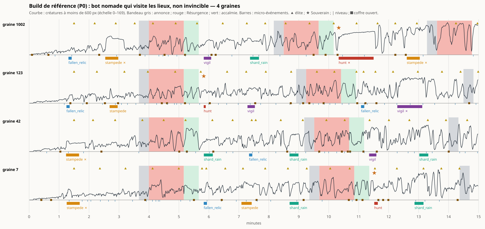
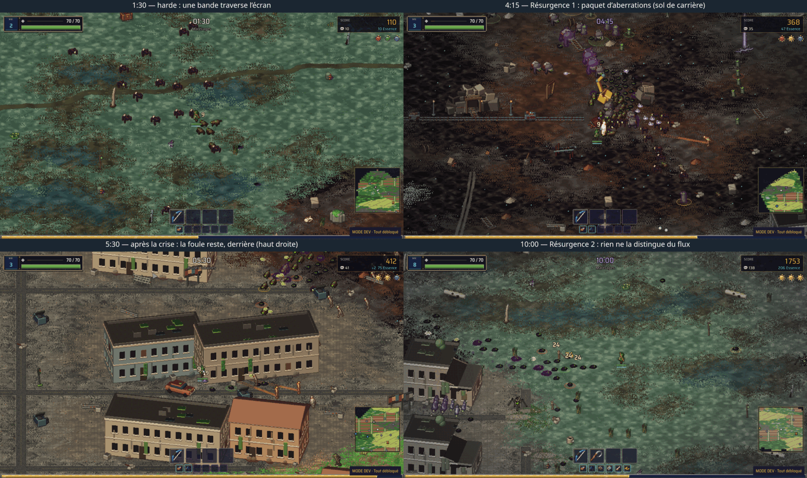
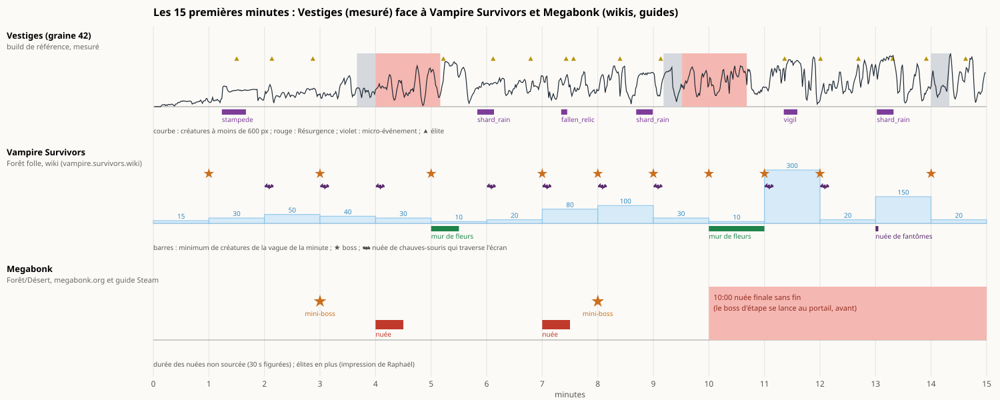

# Plan 30 — Temps forts des 15 premières minutes

9 octobre 2026. Étude demandée au [§83](DECISIONS.md) ([brief](30-temps-forts-brief.md)). Seule la sonde de mesure (lecture seule) est ajoutée. Pistes tranchées le jour même ([§84](DECISIONS.md), §6 ci-dessous) ; rien n'est encore implémenté.

## 0. En bref

- **On a autant de « moments » que Megabonk, mais ils ne marquent pas.** En 10 min : 2 Résurgences et 4 à 5 micro-événements, soit 6 à 7 moments (Megabonk : 2 mini-boss, 2 nuées, 1 boss). En 15 min : 9 à 11.
- **La Résurgence n'est pas un pic.** Pendant la 2e, la foule autour du joueur ne bouge pas (66 → 67 créatures à moins de 600 px) et les dégâts reçus **baissent** (4 600 → 1 900 par minute). Le danger monte **après** la crise (10 300 par minute).
- **Cause mesurée : le plafond de run.** Dès 5 min, la population colle au plafond (110 + 4 par minute) ; la Résurgence relève la densité visée sans relever ce plafond. Avec le plafond relevé à 300 (surcharge de mesure), la 2e Résurgence passe de +2 % à **+64 %** de foule ; le reste de la run ne change pas.
- **Les vrais pics sont les micro-événements** (veille, pluie d'éclats, harde, chasse) : foule rapprochée ×2 à ×3, dégâts reçus ×4 à ×12. Mais ils sont courts : relique ramassée en 6 s, Souverain abattu en 4 et 7 s par le build de référence (médiane ≈ 10 s sur les 8 chasses réussies, tous profils).
- **Pas de boss avant l'Indicible (22 min).** La Barrière, validée pour « vers 12 min, après la troisième Résurgence » (§70), arriverait en fait vers **15 min** : la troisième Résurgence commence entre 13:36 et 14:50.
- **Le rythme est une rampe lisse.** Vampire Survivors fait varier son minimum de créatures de 10 à 300 d'une minute à l'autre, avec un boss presque chaque minute et des nuées qui traversent l'écran. Chez nous, la foule monte régulièrement et tout se joue dans le bruit.

Planches : [chronologie mesurée](planches/30-chronologie-build.png), [captures en jeu](planches/30-captures.png), [comparaison avec Vampire Survivors et Megabonk](planches/30-comparaison.png), [même build, plafond à 300](planches/30-chronologie-plafond-300.png). Données et tableaux complets : [audit du 9 octobre](../audits/temps-forts-2026-10-09/).

## 1. Méthode

**Sonde ajoutée** (`tools/tests/RunTimelineProbe.cs`, option `--timeline` de la mesure) : en lecture seule, elle note l'heure de chaque annonce, début et fin de Résurgence, accalmie, micro-événement (et sa réussite), apparition d'élite, de Souverain ou d'aberration (avec la distance au joueur), coffre ouvert, lieu, niveau. Chaque seconde : phase, événement en cours, variantes en vie et proches, créatures à moins de 300 px, PV cumulés autour du joueur. Dépouillement : `python3 tools/summarize_timeline.py <dossier> [--bin 30] [--svg planche.svg]` (tableaux par tranche, liste des temps forts, creux, contrastes avant/pendant/après).

**Mesures** (`tools/measure_run.sh`, sans rendu, temps accéléré, 4 graines : 42, 1002, 7, 123, 15 min, Péril 0, machine calme hors quota) :

| Profil | Arguments | Ce qu'il représente |
|---|---|---|
| **Build** (référence) | `--nomad --visit --mortal --prefer souffle_du_neant,reflet_brise,memoire_vive,photo_de_classe,jeton_de_fete,oeil_critique` | Protocole P0 du plan 28 : build de Raphaël, bot qui avance et visite les lieux, coups réels |
| Nomade | `--nomad --visit` | Même trajet, premières cartes prises au hasard, invincible |
| Errant | aucun | Bot qui erre autour du départ, invincible |
| Plafond 300 | Build + `--scaling max_enemies_on_screen=300`, 11 min | Expérience : la Résurgence est-elle bridée par le plafond ? |

Plus une capture en temps réel (`tools/capture_run.sh`, 11 min, une image toutes les 15 s, graine 42, bot nomade) pour voir les moments.

**Limites.** Le bot ne fuit pas et n'esquive rien : les dégâts reçus mesurent la pression, pas la survie. Il suit la cible d'un micro-événement, comme un joueur appliqué. « Proches » = à moins de 600 px (l'écran fait 960 × 540 px de monde) ; « rapprochées » = à moins de 300 px.

## 2. La chronologie mesurée

### Calendrier type (les quatre graines, trois profils)

Le tirage change peu le calendrier :

| Heure | Ce qui arrive |
|---|---|
| 0:00–0:08 | Répit, rien n'apparaît |
| 0:08–1:23 | Montée d'ouverture : 5 → 30 créatures proches |
| **1:14–1:18** | Premier micro-événement (harde ou relique) |
| 1:30 | Première élite, puis une toutes les 35 à 55 s (12 en 10 min) |
| **2:32–2:48** | Deuxième micro-événement, une fois sur deux ou trois |
| 3:40 | Annonce de la Résurgence 1 (20 s) |
| **4:00–5:10** | Résurgence 1 |
| 5:10–5:50 | Accalmie (aucun micro-événement possible) |
| **5:49–5:50** | Micro-événement (dans toutes les runs, à la seconde près) |
| **7:05–7:31** | Micro-événement |
| **8:41–8:47** | Micro-événement, une fois sur deux |
| 8:10–9:21 | Annonce de la Résurgence 2 |
| **8:29–9:41** | Résurgence 2 (70 s) |
| ~10:20–11:35 | Micro-événement après l'accalmie |
| ~12:10–13:10 | Micro-événement |
| **13:36–14:50** | Résurgence 3 (intensité 2) |

Souverain (chasse) : présent dans 2 à 3 runs sur 4 en 15 min, avant 10 min dans 1 run sur 4 (2 pour le bot errant) ; tirage pondéré (poids 1,2 sur 4,9), possible dès 2:00.

### Minute par minute (build de référence, moyenne des 4 graines)

| Minute | Proches 600 px | Rapprochées 300 px | En vie / plafond | Apparues /s | Tuées /s | Dégâts reçus /min | Niveau | Résurgence | Événement |
|---|---|---|---|---|---|---|---|---|---|
| 0 | 9 | 4 | 17 / 112 | 1,5 | 0,1 | 490 | 2 | | |
| 1 | 29 | 13 | 54 / 116 | 3,0 | 0,3 | 3 670 | 4 | | 28 % |
| 2 | 40 | 21 | 70 / 120 | 3,4 | 0,8 | 4 160 | 6 | | 18 % |
| 3 | 41 | 15 | 79 / 124 | 5,5 | 1,1 | 2 220 | 8 | annonce | |
| 4 | 57 | 22 | 119 / 128 | 7,9 | 1,6 | 1 710 | 10 | 100 % | |
| 5 | 61 | 27 | 116 / 132 | 6,0 | 1,8 | 3 300 | 13 | accalmie | 14 % |
| 6 | 58 | 24 | 112 / 136 | 7,6 | 2,3 | 3 320 | 16 | | 5 % |
| 7 | 64 | 28 | 112 / 140 | 6,8 | 2,5 | 5 160 | 18 | | 25 % |
| 8 | 68 | 27 | 129 / 144 | 7,8 | 2,7 | 3 160 | 20 | annonce | 15 % |
| 9 | 65 | 23 | 137 / 148 | 9,8 | 2,7 | 2 300 | 22 | 55 % | |
| 10 | 75 | 37 | 140 / 152 | 9,6 | 3,4 | 17 800 | 24 | 48 % | 17 % |
| 11 | 81 | 37 | 147 / 156 | 7,9 | 2,8 | 22 000 | 26 | | 24 % |
| 12 | 91 | 43 | 151 / 160 | 8,4 | 3,3 | 6 510 | 28 | | 32 % |
| 13 | 92 | 47 | 150 / 164 | 7,7 | 3,2 | 15 260 | 30 | annonce | 15 % |
| 14 | 83 | 35 | 155 / 168 | 10,1 | 2,9 | 7 120 | 31 | 48 % | |

Tranches de 30 s, autres profils et liste des temps forts graine par graine : [audit](../audits/temps-forts-2026-10-09/) (`build/`, `nomad/`, `wander/`, `chronologie.md`).



## 3. Lecture

### Chaque moment comparé à la minute d'avant et à celle d'après

Build de référence (les deux autres profils donnent la même lecture, voir l'audit) :

| Moment | n | Durée | Proches 600 px avant / pendant / après | Rapprochées 300 px | Dégâts reçus /min |
|---|---|---|---|---|---|
| Résurgence 1 | 4 | 70 s | 41 / 57 / 61 | 16 / 22 / 29 | 2 450 / 1 710 / 4 610 |
| **Résurgence 2** | 4 | 70 s | **66 / 67 / 78** | 27 / 23 / 33 | **4 620 / 1 870 / 10 260** |
| Relique tombée | 5 | 6 s | 40 / 54 / 49 | 14 / 18 / 17 | 1 190 / 2 290 / 1 340 |
| Chasse (Souverain) | 3 | 27 s | 70 / 82 / 74 | 28 / 54 / 30 | 3 640 / **39 960** / 4 990 |
| Pluie d'éclats | 6 | 18 s | 69 / 90 / 66 | 28 / 51 / 24 | 3 030 / 15 230 / 2 760 |
| Harde | 6 | 23 s | 40 / 70 / 55 | 16 / 48 / 29 | 2 190 / 10 530 / 9 200 |
| Veille | 4 | 24 s | 61 / 96 / 63 | 19 / 54 / 24 | 1 280 / 15 500 / 3 710 |

### Pics

- **Les micro-événements sont les seuls vrais pics.** Ils doublent ou triplent les créatures rapprochées et multiplient les dégâts reçus par 4 à 12, puis tout retombe. Ils durent 15 à 26 s.
- **La chasse est le moment le plus dangereux** (×11 de dégâts reçus)… quand elle dure. Le build de référence abat le Souverain en 4 et 7 s (la troisième chasse échoue : Souverain jamais rattrapé) ; les deux autres profils en 4 à 57 s, médiane 10 s sur les 8 chasses réussies. Un Souverain vaut environ 300 PV de base × la croissance de la run (`hp_target`), soit ~1 000 PV à 6 min, quand le build inflige ~370 dégâts par seconde (P0).
- **La relique tombée n'est pas un temps fort** : ramassée en 6 s dans 18 cas sur 18.
- **La harde échoue souvent** (11 fois sur 19) : elle traverse l'écran en 26 s et le bot n'en abat pas 60 %. Elle passe, comme une nuée de Vampire Survivors, mais avec un objectif affiché qu'on rate.

### Plateaux

- **La Résurgence 1 est une marche, pas un pic** : +40 % de foule au début, et ce niveau reste après la crise (57 → 61).
- **La Résurgence 2 ne se voit pas** : même foule qu'avant, moins de dégâts reçus pendant qu'avant ou après, dans les trois profils.
- **Pourquoi** : la population de la run atteint son plafond à la fin de la première crise et y reste (en vie / plafond à 5 min : 122 / 130 ; à 10 min : 145 / 150 ; 94 à 100 % dans les trois profils). La crise multiplie la densité visée par 1,65 (`crisis_spawn_multiplier`) et ajoute une rafale de 8 (`crisis_burst_base`), mais `TrySpawnEnemy` refuse toute créature au-delà du plafond. Près de la moitié de cette population est hors de l'écran (à plus de 600 px), derrière le joueur qui avance.
- **Vérifié par l'expérience** : plafond de run à 300 (surcharge de mesure, rien de changé dans `data/`), mêmes graines. Résurgence 1 : 41 → **71** (+73 %, contre +39 %) ; Résurgence 2 : 73 → **120** (+64 %, contre +2 %). Hors crise, rien ne bouge (6–7 min : 60–68 proches dans les deux cas). Mais la foule ne retombe pas après la crise (107 à la minute suivante) : sans retrait, la crise reste une marche. [Planche](planches/30-chronologie-plafond-300.png).

### Creux

- **0:00–1:15** : ouverture voulue (répit puis montée, plan 24 L3).
- **Du premier micro-événement à la Résurgence 1** (1:15 ou 2:40 → 4:00) : 80 à 165 s sans rien, le plus long creux des 15 minutes.
- **La fenêtre de la Résurgence** : annonce 20 s + crise 70 s + accalmie 40 s = **130 s sans micro-événement** (règle de `RunEventDirector`), alors que la crise elle-même ne monte pas. La Résurgence, censée être le sommet, est en pratique le plus long moment plat après 5 min.
- **L'accalmie n'en est pas une** : les dégâts reçus doublent dans la minute qui suit la crise (2 450 → 4 610, puis 4 620 → 10 260), parce que la foule levée reste.

### Ce que montrent les images

Capture en temps réel (graine 42, bot nomade sans build, une image toutes les 15 s) :



- **Résurgence 1 (4:15)** : elle se voit, par un paquet compact d'aberrations violettes sur le joueur (84 aberrations apparues pendant les 70 s, d'après la sonde). Le sol sombre est celui de la carrière, pas un effet de crise : la Résurgence ne fait que ternir les bords de l'écran (`CrisisOmen`), ce qui se remarque peu en jeu.
- **Après la crise (5:30)** : le joueur est reparti, les restes de la crise le suivent en haut à droite de l'écran. Pas d'accalmie visible, pas de reflux.
- **Résurgence 2 (10:00)** : une trentaine de créatures éparses ; rien ne la distingue d'une minute ordinaire. Elle fait pourtant apparaître 140 aberrations : sous le plafond, elles **remplacent** des créatures ordinaires au lieu de s'y ajouter. La crise change la composition, pas le nombre.
- **Harde (1:30)** : la bande qui traverse l'écran a déjà la forme d'une nuée de Vampire Survivors.

### Le reste

- **La plupart des créatures n'atteignent jamais le joueur.** Sur 15 min, le build de référence en tue 19 à 40 % ; les autres sont retirées loin derrière lui (à plus de 1 400 px) quand il avance. Une bonne part du plafond de run sert donc à des créatures que le joueur a semées.
- **Élites** : 12 en 10 min (une toutes les 35 à 55 s dès 1:30), mais 0,2 à 0,4 en moyenne à moins de 600 px. Elles apparaissent à 350–600 px et meurent vite : un repère, pas un moment.
- **Niveaux** : 15 à 28 en 10 min selon le build. Le choix de carte est le seul rythme fréquent, toutes les 20 à 40 s.
- **Compte des moments** (Résurgence, micro-événement, Souverain) : **6 à 7 en 10 min, 9 à 11 en 15 min**, dans les trois profils. Parmi eux, ceux qui changent vraiment la situation à l'écran : 3 à 4 en 10 min (les micro-événements hors relique), 15 à 26 s chacun.

## 4. Comparaison



| | Vestiges (mesuré) | Vampire Survivors, Forêt folle | Megabonk, première étape |
|---|---|---|---|
| Durée de l'étape | Pas de fin (boss vers 22 min) | 30 min, la Faucheuse à 30:00 | ~10 min, puis nuée finale sans fin |
| Boss et mini-boss en 10 min | 0 à 1 Souverain (tirage), abattu en 4 à 57 s | 7 apparitions de boss (minutes 1, 3, 5, 7, 8, 9, 10) | 2 mini-boss (3:00 et 8:00), boss d'étape au portail |
| Vagues | Rampe lisse : 30 proches à 1 min, 65 à 9 min, 90 à 13 min | Une vague par minute ; minimum de créatures 15, 30, 50, 40, 30, 10, 20, 80, 100, 30, 10, **300** (minute 11) | 2 nuées (4:00 et 7:00) |
| Événements de carte | 4 à 5 micro-événements à objectif | Nuées de chauves-souris qui traversent l'écran (9 en 15 min), murs de fleurs qui se referment (5:00, 10:00, 15:00), nuée de fantômes (13:00) | — |
| Élites | 12 en 10 min, discrètes | — | Oui (impression de Raphaël) |
| Plafond de créatures | Run : 110 + 4/min (Péril compris) ; coût : 500 | 300 créatures en vie : l'apparition périodique s'arrête ; boss et événements de carte passent outre | — |

**Ce qui diffère vraiment.** Pas le nombre de moments : leur **amplitude** et leur **contraste**. Vampire Survivors alterne des minutes à 10 et à 300 créatures ; ses événements de carte et ses boss passent au-dessus du plafond. Megabonk met un nom et une barre de PV sur deux mini-boss et finit l'étape par un boss. Chez nous, la foule monte d'un bloc, la Résurgence bute sur le plafond, et le seul mini-boss meurt avant d'avoir été vu.

**Sources.** Vampire Survivors : [Mad Forest](https://vampire.survivors.wiki/w/Mad_Forest) (vagues, boss, événements de carte minute par minute) et [Enemies](https://vampire.survivors.wiki/w/Enemies) (« When 300 or more enemies are alive the game will not spawn more enemies periodically » ; une vague par minute, minimum et intervalle propres ; boss et événements de carte hors cycle). Le chiffre de 500 au plus (§83) n'apparaît pas dans les pages lues. Megabonk : [megabonk.org, Timer](https://megabonk.org/guides/mechanics/timer/) (premier mini-boss 3:00, première nuée 4:00, deuxième nuée 7:00, deuxième mini-boss 8:00, nuée finale 10:00) ; un [guide Steam](https://steamcommunity.com/sharedfiles/filedetails/?id=3588811651) donne la même chose en compte à rebours (boss à 7 et 2 min restantes, nuées à 7 et 3), à une minute près pour les nuées ; [discussion Steam](https://steamcommunity.com/app/3405340/discussions/0/687493125920415796/) : la nuée finale part à 0:00 quoi qu'il arrive. Les élites de Megabonk et le « boss au bout des 10 min » viennent de Raphaël.

## 5. Pistes

Chiffres du build de référence. Plafond de coût : 500 créatures (banc du plan 29 : 1 000 tiennent 87 FPS en 1080p).

### Piste A — La Résurgence déborde, puis reflue (réparer le sommet existant)

- **Moment :** chaque Résurgence (4:00, ~9:00, ~14:00).
- **Ce que voit le joueur :** à l'annonce, le monde retient son souffle ; au début, une vague arrive de tous les côtés, l'écran se remplit nettement plus qu'avant ; à la fin, l'Effacement reprend une partie de la foule (les créatures en trop se dissolvent en particules) et l'accalmie est réellement calme pendant 30 à 40 s.
- **Chiffres visés :** créatures proches ×1,6 à ×1,8 pendant la crise (mesuré avec le plafond à 300 : +64 à +73 %), retour sous le niveau d'avant dans les 10 s qui suivent la fin.
- **Réglages :** existants : `crisis_spawn_multiplier` (1,65), `crisis_burst_base` (8), `crisis_burst_per_intensity` (4). **À ajouter :** un multiplicateur du plafond de run pendant la crise (`crisis_cap_multiplier`, ~1,6 : 126 → 200 à 4 min, 146 → 235 à 9 min) et le reflux de fin de crise (part de la population effacée, en commençant par les plus éloignées ; `crisis_ebb_ratio`).
- **Risques :** difficulté : la Résurgence 1 devient plus dure (le plan 24 L3 l'avait adoucie pour le début de run) ; performance : 240 créatures au plus à 9 min, sous le plafond de coût ; lisibilité : le reflux doit se voir, sinon des créatures disparaissent sans raison.
- **Question :** la Résurgence doit-elle être un pic franc qui retombe (A), ou rester une marche qui durcit la suite (comme aujourd'hui, mais assumée) ?

### Piste B — Deux Souverains à heure fixe, qui tiennent

- **Moment :** ~2:45 et ~7:00, entre les Résurgences (calendrier de Megabonk : mini-boss à 3:00 et 8:00, en décalé de nos crises).
- **Ce que voit le joueur :** une annonce (« Un Souverain s'éveille »), une créature locale en grand, nommée, avec une barre de PV en haut de l'écran et son escorte ; un combat de 20 à 40 s ; un coffre rare à sa mort.
- **Chiffres visés :** durée de combat 20–40 s avec le build de référence (aujourd'hui 4 et 7 s) : PV du Souverain ×5 à ×8 (`hp_target` 300 → ~2 000), ou une résistance qui décroît.
- **Réglages :** existants : la chasse (`run_events.json` : `hunt`, escorte, récompenses), la variante `champion` (`_variants.json` : `hp_target`, `hp_mult`, coffre). **À ajouter :** des rendez-vous à heure fixe dans le directeur d'événements (`scheduled_events`), retirés du tirage ; la barre de PV de boss (prévue au lot B1 du plan 07).
- **Risques :** difficulté : un Souverain à 2:45 face à un build de niveau 6 (mesurer à part, viser ~40 s pour un build faible) ; lisibilité : bonne, c'est le format le plus clair ; performance : nulle.
- **Question :** les Souverains deviennent-ils des rendez-vous fixes, ou restent-ils tirés au hasard avec seulement plus de PV ?

### Piste C — La Barrière à 10 min, ancrée à l'heure

- **Moment :** 10:00–11:00, après la Résurgence 2 et son accalmie.
- **Ce que voit le joueur :** le boss intermédiaire déjà validé au §70 (grille, chaînes, poings ; battants selon les Mémoriaux ravivés), en travers de la route, 60–90 s.
- **Pourquoi la déplacer :** la fiche dit « vers 12 min, après la troisième Résurgence », mais la troisième commence entre 13:36 et 14:50 : déclenchée ainsi, la Barrière arriverait vers 15–16 min, à six minutes de l'Indicible. À 10 min, elle partage la run en deux, comme le boss de Megabonk.
- **Réglages :** rien n'existe encore (lots B1–B2 du plan 07). **À fixer :** un déclenchement à l'heure (`barrier_at_sec` ~600, après la fin de l'accalmie si une Résurgence est en cours).
- **Risques :** ordre des chantiers : B1–B2 passent devant les pouvoirs des personnages ; production de sprites ; difficulté à régler sur la mesure en trois postures prévue.
- **Question :** la Barrière vient-elle à 10 min, à l'heure, plutôt qu'après la troisième Résurgence ? Et ce chantier passe-t-il en premier ?

### Piste D — Nuées qui traversent l'écran

- **Moment :** toutes les 60 à 90 s dans les creux (1:45, 3:10, 6:30, 8:00, 11:50…), jamais pendant une Résurgence.
- **Ce que voit le joueur :** sans objectif ni texte, une bande de 20 à 40 créatures rapides traverse l'écran d'un bord à l'autre en 5 à 8 s, puis sort. Une nuée par biome : corbeaux en forêt, chiens en ville, insectes aux champs.
- **Chiffres visés :** 8 à 10 nuées en 15 min (Vampire Survivors : 9 nuées de chauves-souris), foule rapprochée ×2 pendant 5 à 8 s.
- **Réglages :** existants : la harde (`stampede` : nombre, vitesse ×1,7, largeur de bande, créatures préférées). **À ajouter :** un petit calendrier d'« événements de carte » à part, sans objectif ni annonce, qui passe au-dessus du plafond de run (comme Vampire Survivors) et que les créatures quittent en sortant de l'écran.
- **Risques :** lisibilité : la nuée doit se lire comme un passage, pas comme une attaque ciblée ; performance : +40 créatures pendant quelques secondes ; difficulté : faible si elles ne poursuivent pas.
- **Question :** veut-on ces passages sans objectif, en plus des micro-événements ?

### Piste E — Une respiration minute par minute, par biome

- **Moment :** toute la run ; c'est la trame sur laquelle les autres pistes se posent.
- **Ce que voit le joueur :** des minutes calmes (moitié moins de créatures) et des minutes chargées (presque le double), avec une créature dominante qui change : une minute de Rampants, une minute de Charognards. Le joueur apprend à profiter d'un creux pour ouvrir un coffre.
- **Chiffres visés :** densité visée × 0,6 à × 1,8 selon la minute, moyenne sur 5 min inchangée (le Péril et la difficulté du plan 28 ne bougent pas).
- **Réglages :** existants : `local_enemy_target_base` (14) et `_growth_per_minute` (6), groupes de créatures par biome, grappes du même type. **À ajouter :** une table de vagues (`wave_table` : multiplicateur et créature dominante par minute, une table par biome ou une table commune).
- **Risques :** les minutes chargées butent sur le même plafond que la Résurgence (piste A d'abord, ou plafond relevé avec elles) ; écriture et réglage d'une table par biome ; lisibilité : il faut que le changement se voie (dominante visible).
- **Question :** une table commune d'abord, ou une table par biome ?

### Ordre recommandé

1. **A** : c'est une réparation ; la Résurgence existe, elle ne fait pas ce qu'elle annonce. Le coût est petit et la mesure le confirme déjà.
2. **B** : les Souverains existent ; il faut les rendre fixes et solides. Deux mini-boss en 10 min, comme Megabonk.
3. **C** : le boss à 10 min, avec les lots B1–B2 déjà validés.
4. **D** puis **E** si la run manque encore de contraste après A–C.

Avec A, B et C, les dix premières minutes auraient : 2 Souverains (~2:45, ~7:00), 2 Résurgences qui débordent (4:00, ~9:00), la Barrière (~10:00), 4 à 5 micro-événements et 12 élites.

## 6. Décisions du 9 octobre

Questions posées avec `AskUserQuestion`, réponses au [§84](DECISIONS.md) :

| Question | Réponse |
|---|---|
| Résurgence : pic qui reflue, pic sans reflux, ou marche ? | **Pic sans reflux** : plafond de run relevé pendant la crise ; à la fin, pas de retrait forcé, la foule en trop s'use d'elle-même. La piste A se fait sans le reflux. |
| Souverains : rendez-vous fixes ou tirage ? | **Deux rendez-vous fixes** (~2:45 et ~7:00), 20 à 40 s de combat (recommandé). |
| Barrière : à 10 min ? En priorité ? | **À 10 min, à l'heure, en priorité** (recommandé) : B1–B2 du plan 07 passent devant les pouvoirs des personnages. |
| Nuées (D) et respiration (E) : quand ? | **Après A, B et C** (recommandé). |

### Découpage proposé (à engager un lot à la fois)

| Lot | Contenu | Vérification |
|---|---|---|
| **T1 — Résurgence qui déborde** | `crisis_cap_multiplier` dans `spawn_flow.json` (≈ 1,6, lu par `SpawnManager.GetCurrentMaxEnemies` pendant la phase de crise) ; rafale d'ouverture relevée si la mesure le demande ; aucun retrait en fin de crise. | Sonde `--timeline`, mêmes 4 graines et 3 profils : proches pendant / avant ≥ 1,5 aux Résurgences 1 et 2 ; dégâts reçus pendant > avant ; banc dense au pic (≤ 250 créatures attendues à 9 min) ; captures de la Résurgence 2. |
| **T2 — Souverains à heure fixe** | Rendez-vous fixes dans `run_events.json` (`scheduled_events` : chasse à ~165 s et ~420 s), retirés du tirage ; annonce ; PV du Souverain relevés (`hp_target` ~2 000, à régler) ; barre de PV de boss (partie commune avec B1, ou version simple d'abord). | Durée de combat 20–40 s avec le build de référence, ≤ 60 s avec le bot sans build ; dégâts reçus pendant ; captures de l'annonce et du combat. |
| **B1, B2 — Barrière (plan 07)** | Selon la fiche du §70 ; déclenchement à ~600 s (après l'accalmie si une Résurgence est en cours), réglage en données. | Celle du plan 07 (trois postures, durée 60–90 s), plus la chronologie : un pic net à 10–11 min. |

Ordre proposé : T1 (petit, mesuré d'avance), T2, puis B1–B2. D et E restent en attente du jeu.

## T1 livré — 9 octobre 2026

**Fait.** `spawn_flow.json` : `crisis_cap_multiplier` 1,4. `SpawnManager.GetCurrentMaxEnemies` multiplie le plafond de run par ce facteur pendant la phase de crise, toujours borné par le plafond de coût (500). À la fin de la crise, le plafond redescend sans retirer personne (§84). Clé surchargeable par `--scaling` pour les mesures. Rien d'autre ne change (rafale, densité visée, PV, XP de crise).

**Réglage choisi par la mesure** (build de référence, 4 graines, 15 min, surcharge `--scaling`) : 1,4 donne la 2e Résurgence à 63 → 99 créatures proches (×1,57), la foule redescend à 73 après, 216 à 253 en vie au plus. 1,6 ne monte pas plus haut le pic (69 → 108, ×1,57) : la densité visée de la crise (×1,65) devient la limite ; la foule reste à 88 après, 236 à 292 en vie.

**Vérifié avec les données** (3 profils × 4 graines × 15 min, sonde `--timeline`, [chronologies](../audits/temps-forts-2026-10-09/)) :

| Profil | Résurgence 2 : proches avant / pendant / après | Dégâts reçus /min avant / pendant | En vie au plus |
|---|---|---|---|
| Build, avant | 66 / 67 / 78 | 4 620 / 1 870 | 169–191 |
| **Build, T1** | **63 / 95 / 86** (×1,51) | **4 310 / 7 030** | 207–263 |
| Nomade, avant | 68 / 65 / 76 | 5 800 / 2 760 | 170–175 |
| **Nomade, T1** | **69 / 100 / 86** (×1,45) | **5 830 / 10 860** | 209–277 |
| Errant, avant | 74 / 90 / 91 | 7 690 / 3 740 | 171–193 |
| **Errant, T1** | **81 / 133 / 86** (×1,64) | 11 460 / 8 120 | 238–299 |

- Résurgence 1 : ×1,5 à ×1,9 de foule proche (avant : ×1,4 à ×1,7), créatures rapprochées ×1,5 à ×1,9.
- La Résurgence est désormais le moment le plus chargé de sa fenêtre, dans les trois profils. Les dégâts reçus pendant la crise montent pour le build (×1,6) et le nomade (×1,9) ; pour l'errant ils baissent encore (11 460 → 8 120), dans une minute d'avant déjà très chargée.
- Sans reflux, la minute qui suit reste haute (86 proches dans les trois profils) : c'est le choix du §84.
- Progression : deux passes au même réglage (1,4 par surcharge, puis par les données) donnent, pour le build, niveau à 15 min 32,3 et 35,0, éliminations 1 791 et 2 626 : les runs headless ne sont pas déterministes et l'écart avant/après sur les niveaux (31 → 35) est dans ce bruit.

**Coût** (capture temps réel 1080p, graine 42, bot nomade, `--frame-stats`, charge machine 5 au lancement) : pendant la 2e Résurgence, 212 à 224 créatures en vie, 133 à 139 FPS, p99 10,8 à 14,5 ms (avant la crise : 138 FPS, p99 10,3 à 11,8 ms). Les pics à ~300 ms de chaque tranche sont les sauvegardes d'image de la capture. Le banc dense (120 créatures fixes) n'est pas touché par ce changement ; le plan 29 a mesuré 400 créatures à 209 FPS.

**Images** ([avant/après](planches/30-t1-avant-apres.png), [chronologie](planches/30-t1-chronologie-build.png)) : la capture confirme les chiffres (2e Résurgence : 55 → 83 proches, contre 69 → 62 avant T1), mais à un instant donné l'écran n'est pas spectaculaire. Les créatures arrivent dispersées depuis les bords et le joueur avance ; la crise n'a pour signature visuelle que les bords ternis (`CrisisOmen`).

**Régressions :** `dotnet build` 0 avertissement ; `tools/test_movement.sh` et `tools/test_enemy_abilities.sh` : 0 échec. Diff de dix lignes, sans relecture par sous-agent.

**Points ouverts.**
- La crise se mesure mais se voit peu. Pistes, non engagées : une vague qui arrive en anneau dans les premières secondes (rafale d'ouverture plus grosse, posée tout autour de l'écran), une signature visuelle plus forte que les bords ternis. À juger en jouant.
- À jouer par Raphaël : la Résurgence 1 face à un build faible (4:00, niveau 8 à 10).

## T2 livré — 9 octobre 2026

**Fait.**
- `run_events.json` : `schedule.fixed_events`, deux rendez-vous de chasse à 150 s et 420 s (2:30 et 7:00, entre les Résurgences, comme les mini-boss de Megabonk à 3:00 et 8:00). La chasse passe à un poids 0 : elle ne sort plus du tirage. Délai de la chasse 70 → 60 s, pour finir avant l'annonce de la première Résurgence (3:40).
- `RunEventDirector` : un rendez-vous part à son heure, ou dès que la run le permet (pas pendant une Résurgence, son annonce ni l'accalmie) ; s'il ne peut pas se mettre en place (aucun sol praticable), il reste dû et réessaie 5 s plus tard. Le tirage ne lance aucun événement qui déborderait sur le prochain rendez-vous. Un événement de poids 0 sort du tirage.
- `_variants.json`, Souverain : PV ×4 (cible 300 → 1 200, bornes 2,5–12 → 10–48, pour que toutes les créatures soient multipliées pareil) ; liste d'affixes propre (`affix_pool`, lue par `EnemyVariantDataLoader`, utilisée par `SpawnManager.MakeVariant`) sans Tenace : 3 % de PV rendus par seconde annulent un combat de 30 s.
- Pas de bandeau ni de barre de boss au HUD : les annonces restent dans le monde (plan 24 A3). Le Souverain a déjà sa plaque (nom, affixes, PV) ; la flèche de bord, le son et la ligne d'aide de première fois sont ceux de la chasse. La barre de boss commune viendra avec B1.

**Calendrier mesuré** (8 runs, 4 graines × 2 bots) : micro-événement vers 1:15, Souverain à 2:29, Résurgence 1 à 4:00, micro-événement à 5:49, Souverain à 6:59, micro-événement vers 8:20–8:40, Résurgence 2. Aucun chevauchement.

**Durée des combats** (mesure de 9 min, [chronologies](../audits/temps-forts-2026-10-09/)) :

| | Avant T2 (PV ×1, Tenace possible) | Après T2 |
|---|---|---|
| Build de référence | 4 à 7 s (tirage, 1 Souverain sur 4 avant 10 min) | 5 réussies sur 8 : 11, 11, 15, 22, 37 s |
| Bot sans build | 4 à 57 s | 5 réussies sur 8 : 14, 14, 32, 38, 43 s |

- Les échecs (3 sur 8 dans chaque profil, toujours les mêmes graines) viennent du bot, pas du réglage : il s'arrête sur le Souverain, sa cible, la foule l'encercle (60 à 95 créatures à moins de 300 px) et il ne bouge plus de 55 s ; il n'esquive pas et ne court pas. Avec les PV d'avant, ces mêmes graines échouaient déjà parfois. Sans eux, la durée médiane est de 15 s (build) et 32 s (sans build).
- **Outil de mesure corrigé :** bloqué loin de la cible d'un événement (bord du monde, Néant, eau), le bot fait maintenant un détour de 3 s avant de reprendre la cible ; avant, suivre la cible annulait sa règle « bloqué 2 s, changer de cap » et il poussait contre le bord jusqu'à la fin. Un essai où le bot tournait autour du Souverain a été abandonné : il le touchait moins (6 échecs sur 8). La sonde relève aussi les PV max, les affixes et la position du joueur.

**Images** ([planche](planches/30-t2-souverain.png), graine 7, bot sans build) : à 2:30 la ligne d'aide « Abattez le Rampant Souverain avant son effacement » ; à 2:40 le Souverain arrive avec sa meute, plaque et gros chiffres de dégâts. Ce Rampant Cuirassé et Enragé s'enterre par moments ; il tombe de 2 132 à ~500 PV en 55 s, et le temps s'écoule juste avant la fin. À l'écran, le Souverain reste petit (×1,6) : il se lit surtout par sa plaque.

**Relecture** (sous-agent `godot-reviewer`), deux corrections :
- un rendez-vous retardé par une accalmie pouvait partir à moins de 60 s de la Résurgence suivante et la chevaucher : il attend désormais une fenêtre assez longue (même règle que le tirage) ;
- un rendez-vous échu qui échouait en boucle à se poser bloquait tout le tirage : seul un rendez-vous à venir réserve sa place.
Remarque écartée : les PV ×4 valent pour tout Souverain, mais seule la chasse en crée.

Mesure après corrections (build de référence, 4 graines, 10 min) : même calendrier ; 6 chasses réussies sur 8, en 5, 22, 24, 25, 27 et 58 s (médiane 24,5 s).

**Régressions :** `dotnet build` 0 avertissement ; `tools/test_movement.sh` et `tools/test_enemy_abilities.sh` : 0 échec.

**Points ouverts.**
- À jouer par Raphaël : la durée réelle du combat (cible 20–40 s), surtout le premier Souverain avec un build de niveau 4 à 6. Repli possible : PV ×3 (cible 900).
- Le Souverain se lit peu à l'écran (taille ×1,6, plaque petite) ; la barre de boss de B1 y répondra en partie.

## 7. Reproduire

```bash
MEASURE_JOBS=4 MEASURE_EXTRA_ARGS="--timeline --nomad --visit --mortal --prefer souffle_du_neant,reflet_brise,memoire_vive,photo_de_classe,jeton_de_fete,oeil_critique" \
  systemd-run --user --scope --quiet --collect tools/measure_run.sh <dossier neuf> 900 "42 1002 7 123"
python3 tools/summarize_timeline.py <dossier> --bin 60 --svg planche.svg
```

Code mesuré : `d7789e9f` plus la sonde. Les CSV de chaque graine (`density`, `beats`, `timeline`) sont dans l'[audit](../audits/temps-forts-2026-10-09/).
